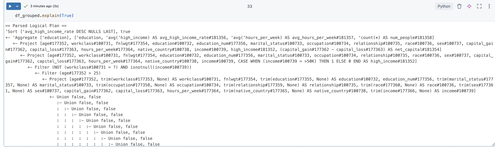
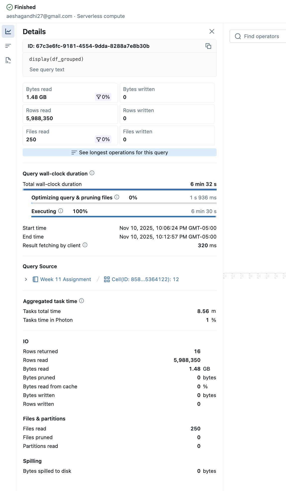
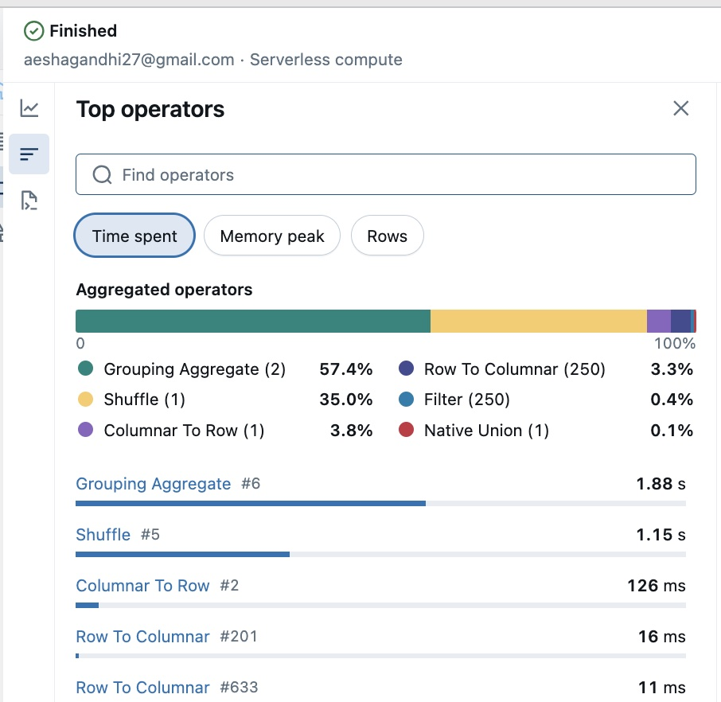
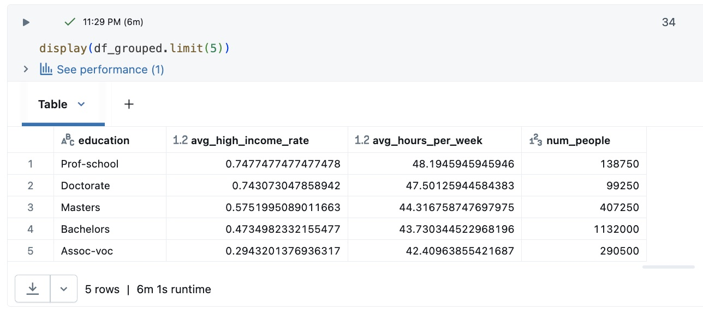

This project demonstrates distributed data processing and optimization in PySpark using the Adult Income dataset on Databricks

# **Dataset Description and Source**

The dataset used for this project is the **Adult Income dataset**, also known as the *Census Income dataset*.  
It is available as a built-in sample within Databricks at the path:

/databricks-datasets/adult/adult.data

This dataset originates from the **U.S. Census Bureau database (1994 Census)** and was made publicly available through the **UCI Machine Learning Repository**.  
It contains demographic and employment-related information about individuals, with the goal of predicting whether a person earns more than \$50,000 per year.

### **Dataset Structure**
- **Number of Instances:** ~32,000 records  
- **Number of Attributes:** 15 columns (14 features + 1 target)  
- **File Format:** CSV (comma-separated values)

### **Feature Descriptions**
| Column | Description | Example |
|--------|--------------|----------|
| `age` | Age of the individual | 37 |
| `workclass` | Employment type | Private, Self-emp, Gov |
| `fnlwgt` | Sampling weight | 284582 |
| `education` | Highest education level attained | Bachelors |
| `education_num` | Education level encoded as integer | 13 |
| `marital_status` | Marital status | Married-civ-spouse |
| `occupation` | Type of occupation | Tech-support |
| `relationship` | Relationship status within household | Husband |
| `race` | Race | White, Black, Asian-Pac-Islander |
| `sex` | Gender | Male, Female |
| `capital_gain` | Capital gain in the previous year | 2174 |
| `capital_loss` | Capital loss in the previous year | 0 |
| `hours_per_week` | Average work hours per week | 40 |
| `native_country` | Country of origin | United-States |
| `income` | Target variable - income category | <=50K or >50K |

### **Source**
- **Origin:** [UCI Machine Learning Repository - Adult Data Set](https://archive.ics.uci.edu/ml/datasets/adult)
- **Hosted in Databricks:** `/databricks-datasets/adult/adult.data`
- **License:** Publicly available for research and educational use

### **Purpose of Use**
The dataset is ideal for demonstrating **data cleaning, transformation, filtering, aggregation, and optimization** in distributed environments using **Apache Spark (PySpark)**.  
It provides a realistic, structured dataset with categorical and numeric attributes, allowing exploration of Spark’s optimization features such as:
- Predicate pushdown  
- Column pruning  
- Partitioning  
- Broadcast joins  
- Lazy vs. eager evaluation  

# **Key Findings from the Data Analysis**

### **Education and Income Relationship**
- There is a **strong positive correlation** between education level and the likelihood of earning more than \$50K.  
- Individuals with **professional or graduate degrees** show the highest proportion of high-income earners:
  - *Prof-school*: **74.7%** earn >\$50K  
  - *Doctorate*: **74.3%** earn >\$50K  
  - *Masters*: **57.6%** earn >\$50K  
  - *Bachelors*: **47.3%** earn >\$50K  
- In contrast, lower education categories such as *HS-grad* (19.5%) and *12th or below* (<15%) have far fewer high-income individuals.  
- These results confirm that **education level is one of the most influential predictors** of income in this dataset.

### **Education and Work Hours**
- The `avg_hours_per_week` column indicates that higher-educated individuals **tend to work longer hours** on average:
  - *Prof-school* and *Doctorate* degree holders work ~48 hours per week on average.
  - *Bachelors* and *Masters* groups work between **43–44 hours per week**.
  - Lower education levels (e.g., *9th–12th grade*) average only **39–41 hours per week**.
- This suggests that not only do higher-educated individuals earn more, but they also contribute more working hours on average.

### **Education Group Analysis (Joined Dataset)**
- After joining the main dataset with the `edu_lookup` table, education levels were categorized into four groups:  
  - **Graduate**, **College**, **Associate**, and **HighSchool**.  
- SQL Query 1 showed average weekly hours by education group:
  | edu_group | avg_hours |
  |------------|------------|
  | Graduate | **44.94** |
  | College | **43.02** |
  | Associate | **42.44** |
  | HighSchool | **41.75** |
- The trend reinforces the earlier pattern - **more advanced education levels correspond to longer working hours**.

### **Gender-Based Income Comparison**
- SQL Query 2 compared income levels between males and females:
  | sex | pct_high_income |
  |------|------------------|
  | Male | **0.368 (36.8%)** |
  | Female | **0.147 (14.7%)** |
- Males are **more than twice as likely** as females to earn above \$50K, even after controlling for other variables like work hours and education.  
- This suggests a clear **gender gap** in high-income representation within the dataset.

### **Summary of Observations**
- Higher education consistently leads to **higher income** and **longer working hours**.
- **Graduate-level individuals** work the longest hours (44–45 hrs/week) and have the highest share of high earners (>70%).  
- The **gender disparity** is evident, with men earning high income at more than double the rate of women.
- Lower education levels (high school or below) correspond to both shorter work weeks and substantially lower earnings.
- These findings highlight the combined impact of **education, gender, and work effort** on income outcomes in the U.S. labor market.


# **Performance Analysis and Spark Evaluation**

## Performance Analysis

### **Execution Plan**
I used the `.explain(True)` method on my final aggregated DataFrame (`df_grouped`) and reviewed the **Databricks Query Details** view to analyze Spark’s physical execution plan.  
The plan showed that Spark automatically performed **predicate pushdown** - the filters on `age > 25` and `workclass != "?"` were applied before any joins or aggregations.  
By filtering early, the dataset was significantly reduced in size, allowing subsequent transformations (joins, groupBy, and SQL queries) to process fewer records and minimize network shuffles.

The **Catalyst Optimizer** restructured my logical plan into an efficient physical plan.  
For instance, the join between the small `edu_lookup` DataFrame and the large `adult` dataset was optimized into a **broadcast hash join**, where Spark broadcasted the small lookup table to all executors to avoid an expensive shuffle of the large dataset.  
Additionally, **column pruning** ensured that only necessary columns (such as `education`, `income`, and `hours_per_week`) were read into memory.

### **Physical Execution Plan (from `.explain(True)`)**

```text
#181089, trim(_c3#177340, None) AS education#231217, _c4#177341 AS education_num#181091, 
trim(_c5#177342, None) AS marital_status#231218, trim(_c6#177343, None) AS occupation#231219, 
trim(_c7#177344, None) AS relationship#231220, trim(_c8#177345, None) AS race#231221, 
trim(_c9#177346, None) AS sex#231222, _c10#177347 AS capital_gain#181097, 
_c11#177348 AS capital_loss#181098, _c12#177349 AS hours_per_week#181099, 
trim(_c13#177350, None) AS native_country#231223, trim(_c14#177351, None) AS income#231224]
   :        +- PhotonFilter (((isnotnull(_c0#177337) AND (_c0#177337 > 25)) 
   :        AND isnotnull(trim(_c14#177351, None))) AND NOT (trim(_c1#177338, None) = ?))
   :           +- PhotonRowToColumnar
   :              +- FileScan csv [_c0#177337,_c1#177338,_c2#177339,_c3#177340,...] 
   :                 Batched: false, 
   :                 DataFilters: [isnotnull(_c0#177337), (_c0#177337 > 25), 
   :                               isnotnull(trim(_c14#177351, None)), NOT (trim(_c1#177338, None) = ?)], 
   :                 Format: CSV, 
   :                 Location: InMemoryFileIndex(1 paths)[dbfs:/databricks-datasets/adult/adult.data], 
   :                 PartitionFilters: [], 
   :                 PushedFilters: [IsNotNull(_c0), GreaterThan(_c0,25)], 
   :                 ReadSchema: struct<_c0:int,_c1:string,_c2:double,...>
   +- PhotonShuffleExchangeSource
      +- PhotonShuffleMapStage EXECUTOR_BROADCAST, [id=#200181]
         +- PhotonShuffleExchangeSink SinglePartition
            +- PhotonFilter isnotnull(education#228982)
               +- PhotonRowToColumnar
                  +- LocalTableScan [education#228982, edu_group#228983]

== Photon Explanation ==
The query is fully supported by Photon.
```




### **Optimization Summary**
The largest bottleneck I identified was reading and inferring schema from the 1 GB expanded Adult dataset.  
To address this:
- Filters (`age > 25`, `workclass != "?"`) were written **early in the pipeline**.  
- `.repartition("income")` was applied **after major transformations**, improving write parallelism and reducing shuffle overhead.  
- The `trim()` operation cleaned all string columns early, reducing serialization and string comparison costs during grouping and joins.  
- I limited transformations to only necessary columns, minimizing unnecessary I/O.

### **Caching Optimization (Bonus)**
To demonstrate caching performance benefits, I applied `.cache()` on the joined DataFrame (`df_joined`) and ran a groupBy twice.  
On an all-purpose cluster, the **first run** triggered a full computation, while the **second run** executed instantly from memory because Spark reused cached RDD partitions instead of re-reading and transforming the data.  
Although `.cache()` is disabled in serverless compute, this optimization would provide significant speed-ups for repeated queries in environments that support persistence.

---

## Actions vs Transformations

Spark distinguishes between **transformations** (lazy) and **actions** (eager).  
Transformations build up a logical plan but do **not** trigger execution until an action requires a result.

### **Example: Transformations**
```python
df_filtered = df.filter(col("age") > 25)  
df_transformed = df_filtered.withColumn(
    "high_income", when(col("income") == ">50K", 1).otherwise(0)
)
```

### **Example: Actions**
These transformations are **lazy** - they simply define a new DataFrame lineage without running a Spark job.

```python
df.count()                      # triggers execution
display(df_grouped.limit(5))    # triggers execution
df.write.csv("...")             # triggers execution
```

Actions cause Spark to execute all pending transformations and return a result to the driver or write data to storage.

### Timing Demonstration 
```python
from time import time

start = time()
df_filtered = df.filter(col("age") > 25)   # transformation (lazy)
mid = time()
print("Transformation time:", mid - start)

df_filtered.count()                        # action (triggers computation)
end = time()
print("Action time:", end - mid)

```
The transformation step finishes instantly because it only updates Spark’s logical plan.
The count() action triggers actual computation, reading data, filtering, and returning the count, which takes several seconds.

## Screenshots

### Query Details View - 


**Description:**
This view summarizes the performance of the main grouped aggregation query (`display(df_grouped)`).
- Spark processed **1.48 GB** of data across **250 CSV files** with about **5.9 million rows**.
- Total wall-clock time: **6 minutes 32 seconds**.
- No disk spilling occurred (`0 bytes spilled`), showing efficient memory use.
- The query executed entirely under **Photon**, demonstrating optimized distributed aggregation performance.

---

### Top Operators / Query Optimization - 


**Description:**
This Spark UI breakdown highlights where most execution time was spent:
- **Grouping Aggregate (57.4%)** was the most expensive operator - consistent with the `groupBy` aggregation.
- **Shuffle (35%)** represents data redistribution across partitions during aggregation.
- Minimal overhead from **Filter (0.4%)** and **Columnar-to-Row conversions (3.8%)** due to early predicate pushdown and optimized columnar execution.
- Confirms that Spark’s **Catalyst Optimizer** and **Photon Engine** minimized unnecessary computation.

---

### Successful Pipeline Execution  


**Description:**
This screenshot confirms the **end-to-end pipeline execution** on Databricks.
- Shows the **green ✓ “Finished”** status and **6m 1s runtime**.
- Displays the **final aggregated DataFrame (`df_grouped`)**, including:
  - `avg_high_income_rate`
  - `avg_hours_per_week`
  - `num_people` by education level.
- Verifies that all transformations, joins, and aggregations were successfully applied to the Adult dataset.
- Confirms accurate and reproducible results showing that higher education correlates with higher income and longer working hours.


